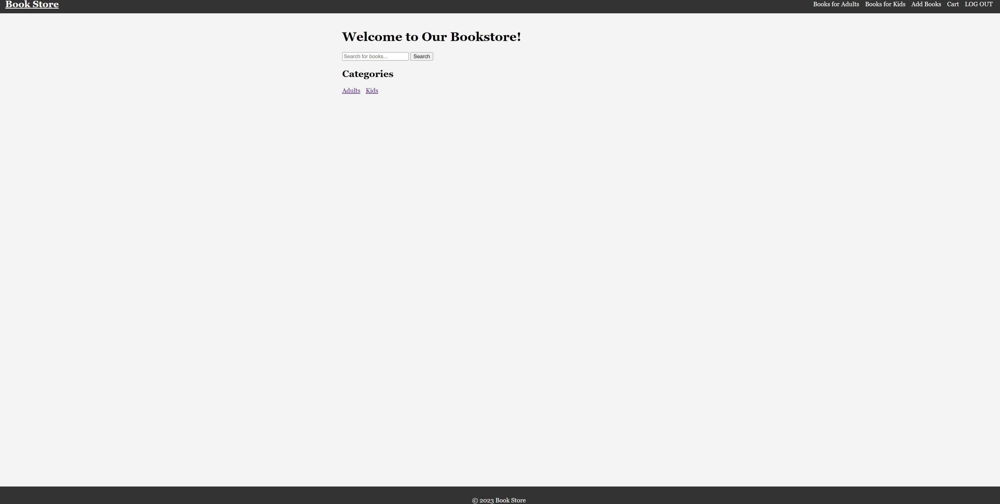
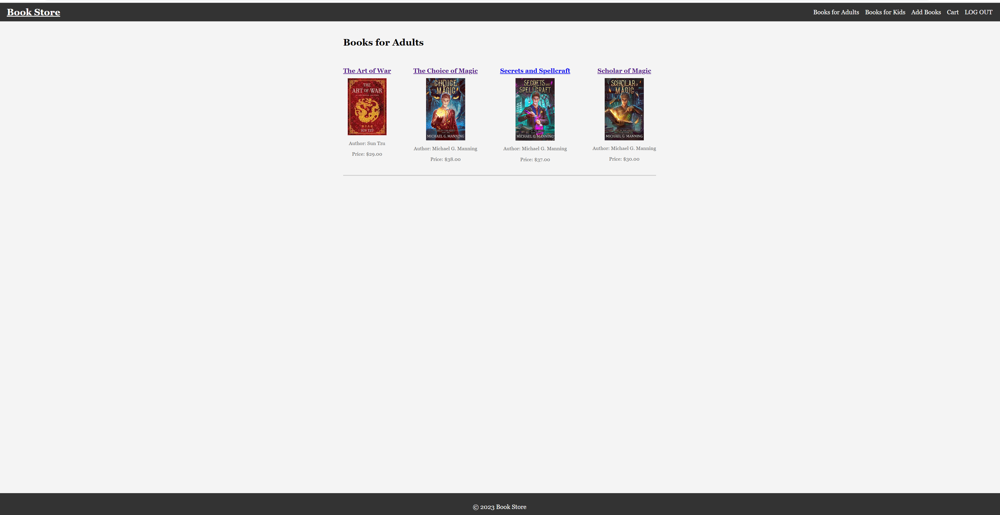
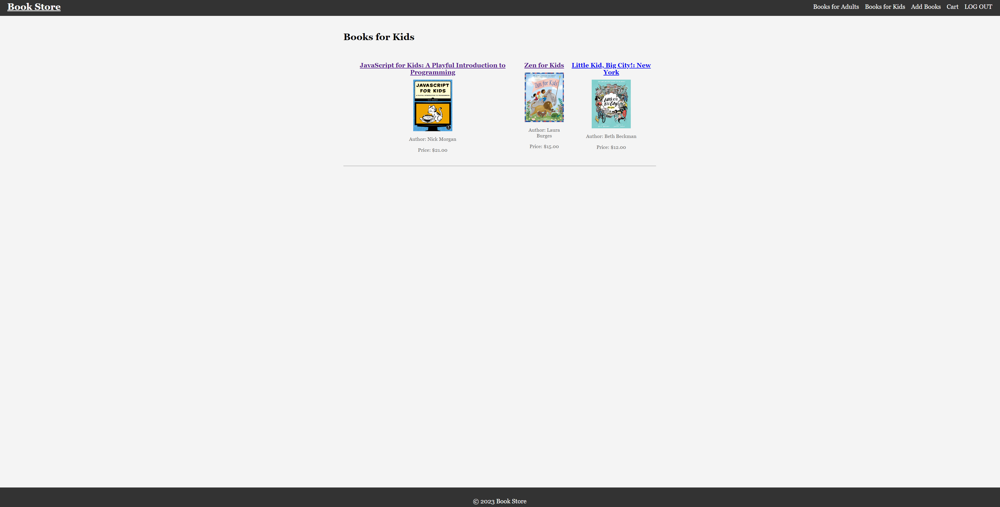
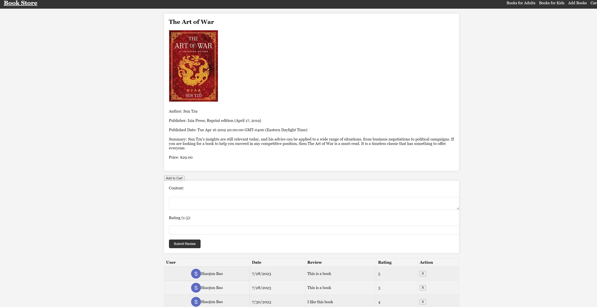
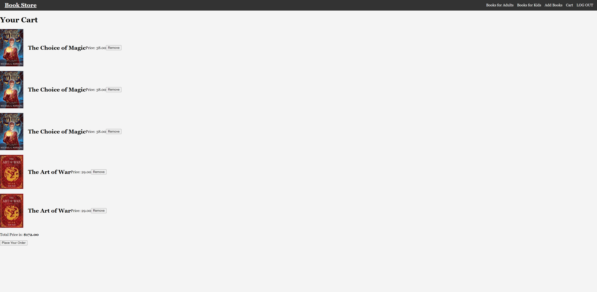

# <Project title>
Project2_Bookstore. By using this bookstore app, the user can add new books for different categories "adults" and "kids". It has the searching feature that allows user to search the book by keywords. The user can only add book to cart or leave comment and rating when the user login to the website. It also used google people api that allows user to login to the website by using their google username and password. 

# Screenshot

# Technologies Used

- JavaScript
- HTML
- CSS
- Jquery
- NodeJs
- MongoDb
- Mongoose
- Google API

# Getting Started

https://project2-bookstore-app-4584920acb4d.herokuapp.com/

# Next Steps

- Future enhancement one: I'm thinking of improve my homepage's performance. Add featured books to the homepage, but now I haven't figure out how to do that.
- Future enhancement two: Add administrator to the app, so only the administrator can add book. However, if I do so I have to use another APAI instead of the one provided by our lovely instructors. I'm also not familiar with calling API to the app, so I will try to impelement that in the future.
- Future enhancement two: The current vizualization is not good enough. I want to display 4 books each row, but I think I need to use loop to create a new "bookshelf-row" div for every four books. However, I'm really bad at building ejs. I haven't figure out how to do that.  